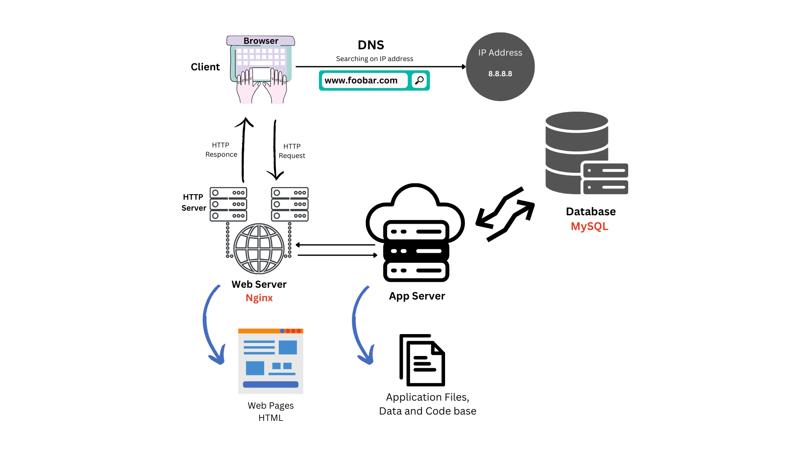
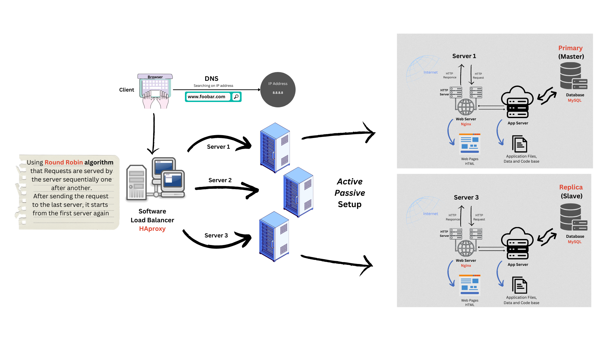
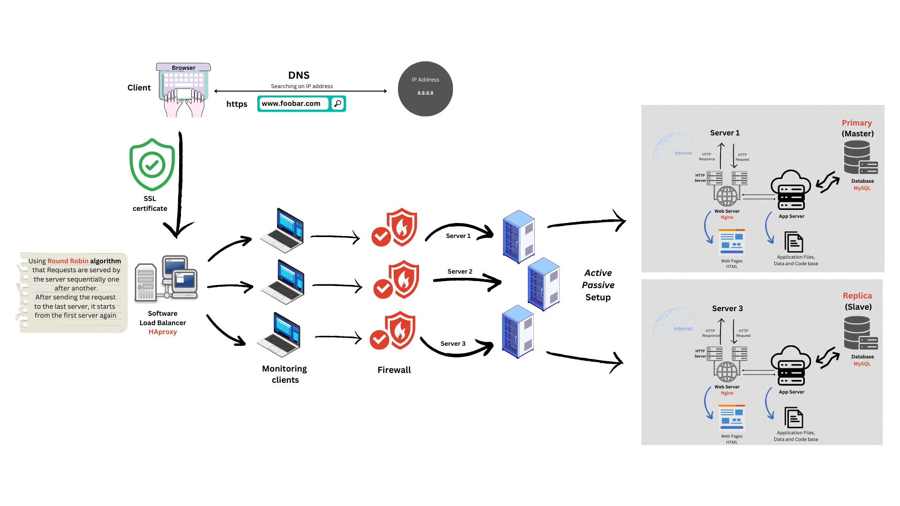
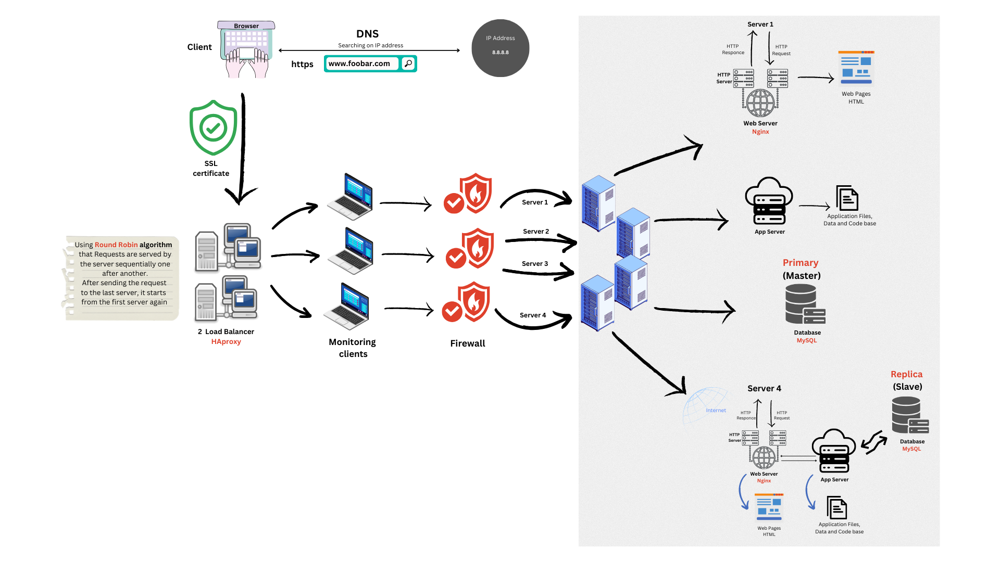

# Web_infrastructure_design

**In this project:**

- [x] You must be able to draw a diagram covering the web stack you built with the sysadmin/devops track projects
- [x] You must be able to explain what each component is doing
- [x] You must be able to explain system redundancy
- [x] Know all the mentioned acronyms: LAMP, SPOF, QPS

**Task 0**

---

**Task 1**

---

**Task 2**

---

**Advanced**

---
